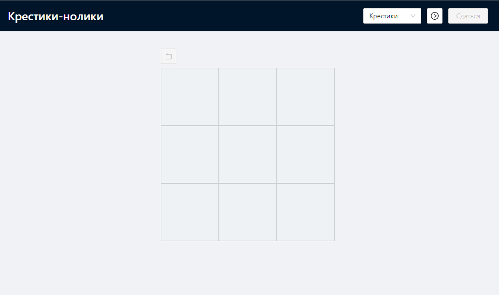

# Крестики-Нолики
Игра крестики-нолики, написана на React (Next.js) + TypeScript + Ant.d + RTK + Featured-sliced Design.

## Функциональность
- выбор стороны (крестики/нолики)
- возможность вернуться назад, до первого хода в партии
- возможность сдаться

Игра полонстью адаптирована под мобильные телефоны

